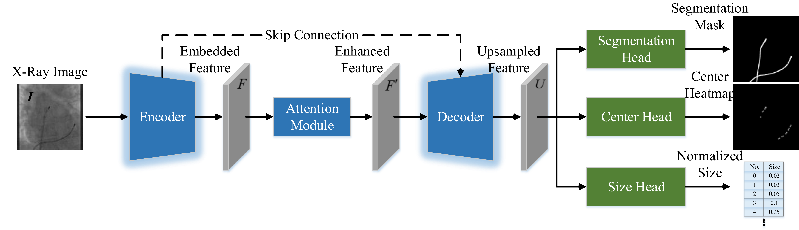

# Catheter Detection and Segmentation in X-ray Images via Multi-task Learning

This is an official implementation of "Catheter Detection and Segmentation in X-ray Images via Multi-task Learning" (IPCAI2025).


##  Abstract
In this paper, we present a convolutional neural network model that integrates a resnet architecture with multiple prediction heads to achieve real-time, accurate localization of electrodes on catheters and catheter segmentation in an end-to-end deep learning framework. We also propose a multi-task learning strategy in which our model is trained to perform both accurate electrode detection and catheter segmentation simultaneously. A key challenge with this approach is achieving optimal performance for both tasks. To address this, we introduce a novel multi-level dynamic resource prioritization method. This method dynamically adjusts sample and task weights during training to effectively prioritize more challenging tasks, where task difficulty is inversely proportional to performance and evolves throughout the training process.

The proposed method has been validated on both public and private datasets for single-task catheter segmentation and multi-task catheter segmentation and detection. The performance of our method is also compared with existing state-of-the-art methods, demonstrating significant improvements, with a mean $\mathcal{J}$ of 64.37/63.97 and with average precision over all IoU thresholds of 84.15/83.13, respectively, for detection and segmentation multi-task on the validation and test sets of the catheter detection and segmentation dataset. Our approach achieves a good balanced between accuracy and efficiency,making it well-suited for real-time surgical guidance applications.

For a detailed explanation of the method, refer to our paper.

<a href="https://arxiv.org/abs/2503.02717" target="_blank"></a>

<p align="center">
  
  <br>
    <em>Framework overview of the proposed catheter detection and segmentation in X-ray images via multi-task learning.</em>
</p>

## Installation & Run

### 1. Environment
You can use the following command to prepare your environment.
```bash
conda create -n cathmtl python=3.10
conda activate cathmtl
pip install torch==2.5.0 torchvision==0.20.0 torchaudio==2.5.0 --index-url https://download.pytorch.org/whl/cu118
pip install scipy pandas matplotlib tensorboard ml_collections opencv-python
pip install numpy==1.23.5
pip install timm==0.5.4
```

### 2. Data
Place the data (or create symlinks) to make the data folder like:
~~~
${CathMTL_ROOT}
|--- data
     |--- DukeData
     |    |-- test
     |    |-- train
     |    |-- val
     | -- CatheterSegmentationData
     |    |-- Phantom
     |    |-- T1T2
     |    |-- T3-T6
     | -- XRayCath
          |-- test
          |-- trainval
~~~
**Attention**: you need to specify the root directory of your datasets using the ```data_root``` and ```dataset``` variables in ```scripts/train.sh```.

### 3. Training
The following commands can be used to train the model.
```bash
bash scripts/train.sh
```

### 4. Evaluation
The following commands can be used to evaluate the pre-trained models provided in this repository.
```bash
bash scripts/test.sh
```

## Citation

If you find our work useful in your research please consider citing our paper!

```bib
@article{xi2025catheter,
  title={Catheter Detection and Segmentation in X-ray Images via Multi-task Learning},
  author={Xi, Lin and Ma, Yingliang and Koland, Ethan and Howell, Sandra and Rinaldi, Aldo and Rhode, Kawal S},
  journal={arXiv preprint arXiv:2503.02717},
  year={2025}
}
```

## Contact

If you have any questions, please feel free to contact Lin Xi (xilin.chibchin@outlook.com) and Yingliang Ma (yingliang.ma@uea.ac.uk).

## Acknowledgement

This project would not have been possible without relying on some awesome repos: <a href="https://github.com/FengheTan9/Medical-Image-Segmentation-Benchmarks" target="_blank">Medical-Image-Segmentation-Benchmarks</a>. We thank the original authors for their excellent work.